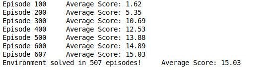
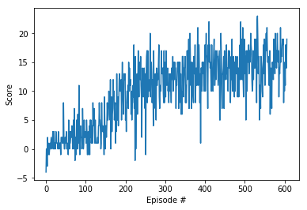

# banana-collecter-agent

 ## network description  

in the first of this challange i tried with a big architecteur with 6 layers and a big number of unites, after more 1000 episode i found out that this architector donesn't help the agent to learn at all. so after different networks, i found out that a small one can give much better resautls, so i ended up with 3 layer NN.

## the training and the results 
in my project i used this paramaters 
> BUFFER_SIZE = int(1e5) 
> BATCH_SIZE = 256     
> GAMMA = 0.99          
> TAU = 0.003              
> LR = 4e-5               
> UPDATE_EVERY = 4 

and i got an avrege of rewards equal to 15.03 just after 607 episodes.

  

and the plot of rewards is 

  

## future work
this project can be improved in many sides.
- 1 - use images as the input.
- 2 - parameter tuning.

and other improvemnts 